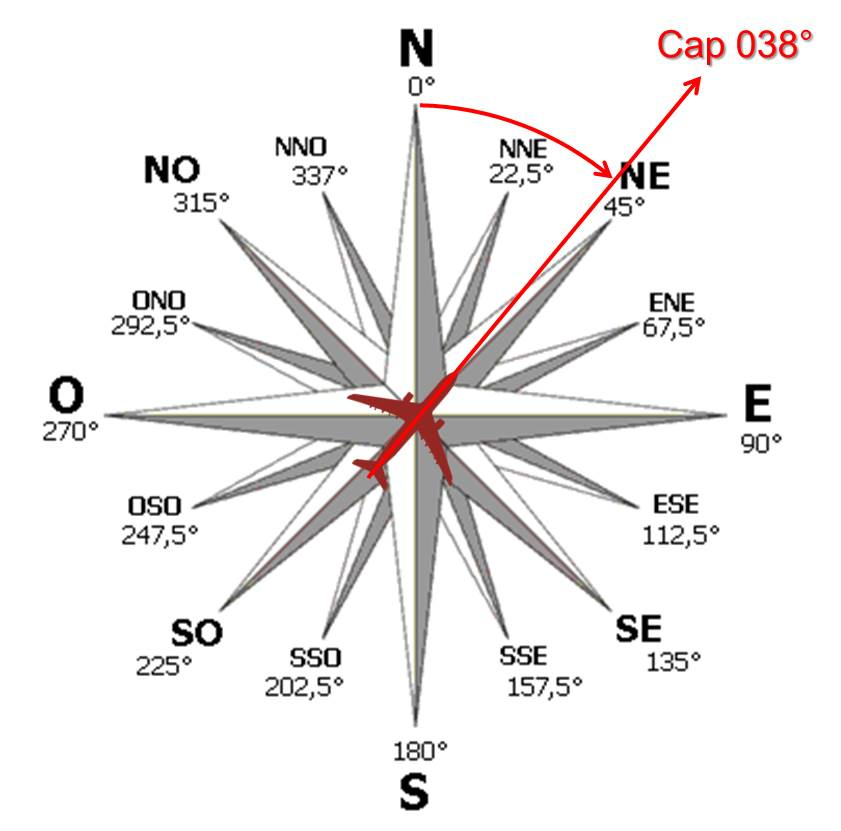
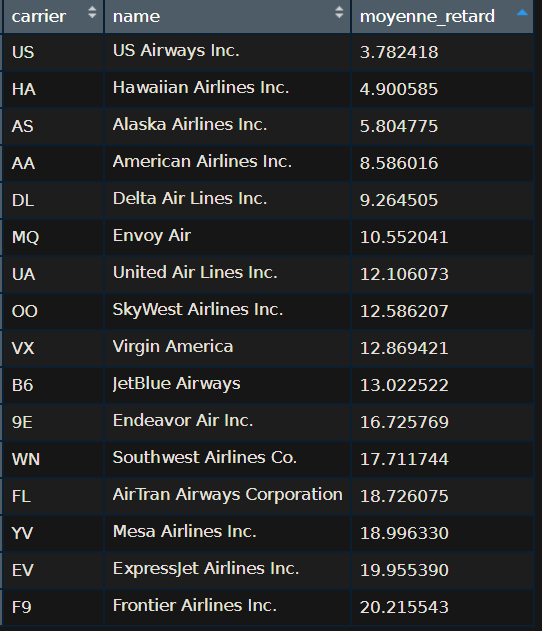

## Import des modules

```{r}
library(tidyverse)
library(nycflights13)

data(flights)
flights <- flights

data(weather)
weather <- weather

data(planes)
planes <- planes

data(airports)
airports <- airports

data(airlines)
airlines <- airlines
```

# Premier traitement

**nycflights13** est le package qui nous propose cinq bases de données listant différents paramètres qui interviennent lors des vols au départ de NewYork, tels que :    
 - les **conditions climatiques** heure par heure,   
 - les **compagnies aériennes**,    
 - ou encore les **informations précises sur les différents vols**.   

On se rend compte que certaines bases de données ne nous seront pas utiles pour notre études, c’est pourquoi nous nous intéresserons davantage à la bases de données **flights** , **weather** et **airline**.

## I. Base de données ***flights***
```{r}
?nycflights13::flights # Affichage de la définition des variables
```

### 1. Afficher les noms et le type des variables présentes dans **flights**

Nous commençons dans un premier temps par analyser **flights**.   
On souhaite se pencher sur les colonnes « distance », « dep_delay », « arr_delay » et « air_time ».    

#### a. Méthode 1 avec fonction lapply() :
```{r}
c(lapply(flights, mode))
```
  
#### b. Méthode 2 avec la fonction str() :
```{r}
str(flights)
```

#### c. Méthode 3 avec une boucle for :
```{r}
for (i in colnames(flights)){
  print(i)
  print(mode(flights[[i]]))
  print("----------")
}
```

### 2. Gestion des valeurs manquantes
On souhaite recupérer les lignes qui ont une valeur manquante dans au moins une des variables citées.

On remarque alors la présence de valeurs manquantes, deux possibilités s’offrent alors a nous :  
 - supprimer les lignes contenant des valeurs manquantes  
 - remplacer par une d’autres valeurs   
Nous, choisirons de ne pas les prendre en compte dans nos prochains calculs grâce au paramètre “**na.rm =**”.

```{r}
flights_na <- flights %>% filter(is.na(distance) | is.na(dep_delay) | is.na(arr_delay) | is.na(air_time))
```

On peut supposer que certains vols ont été annulés, notamment les lignes où on retrouve des valeurs nulles à l’heure départ et à l’heure d’arrivée.

On les enregistres
```{r}
write.table(flights_na, file = "flights_na.csv", sep = ',')
```

### 3. Conversion vers des unités de mesures plus familières
```{r}
flights_1 <- flights %>% 
  mutate(dist_km = distance*1.609,
         kmh=(dist_km/air_time)*60) %>% 
  select(time_hour, origin, dest, dep_delay, arr_delay, air_time, dist_km, kmh)
```

### 4. Statistiques
Nous souhaitons à présent observer les données statistiques de nos vols en fonction des aéroports de départ (les valeurs des distances étant en miles nous les avons convertis en kilomètres) :   

#### STATS DISTANCE
```{r}
flights_1 %>% 
  group_by(origin) %>% 
  summarise(moyenne_distance = mean(dist_km, na.rm = TRUE),
            ecarttype_distance = sd(dist_km, na.rm = TRUE),
            min_distance = min(dist_km, na.rm = TRUE),
            ma_distancex = max(dist_km, na.rm = TRUE))
```

#### STATS DEP_DELAY
```{r}
flights_1 %>% 
  group_by(origin) %>% 
  summarise(moyenne_dep_delay = mean(dep_delay, na.rm = TRUE), 
            ecarttype_dep_delay = sd(dep_delay, na.rm = TRUE),
            min_dep_delay = min(dep_delay, na.rm = TRUE),
            max_dep_delay = max(dep_delay, na.rm = TRUE))
```

#### STATS ARR_DELAY
```{r}
flights_1 %>% 
  group_by(origin) %>% 
  summarise(moyenne_arr_delay = mean(arr_delay, na.rm = TRUE),
            ecarttype_arr_delay = sd(arr_delay, na.rm = TRUE),
            min_arr_delay = min(arr_delay, na.rm = TRUE),
            max_arr_delay = max(arr_delay, na.rm = TRUE))
```

#### STATS AIR_TIME
```{r}
flights_1 %>% 
  group_by(origin) %>% 
  summarise(moyenne_air_time = mean(air_time, na.rm = TRUE), #na.rm ne compte pas les valeurs NULL
            ecarttype_air_time = sd(air_time, na.rm = TRUE),
            min_air_time = min(air_time, na.rm = TRUE),
            max_air_time= max(air_time, na.rm = TRUE))
```

En observant ces chiffres, on peut déjà s’apercevoir grâce à l’écart-type de la dispersion des vols selon les aéroport, en effet :    
 - EWR et JFK ont tendance à proposer **plus de vols** que LGA    
Avec les valeurs maximum et minimum on remarque aussi que :   
 - EWR et JFK ont effectué **plus de long trajet** que LGAen distance et en durée   
 - EWR et JFK ont un **taux de retard au départ et à l’arrivée supérieur** à ceux de LGA (EWR et JFK semblent être des aéroports internationaux et LGA plutot dédié aux vols internes)  

On peut alors se questionner sur le **lien entre la quantité de vols proposés par l’aéroport et les retards**, ou encore sur l’éventuelle **corrélation entre la distance et les retards** occasionnés.

## II. Base de données ***weather***

Sachant que nous avons à notre disposition plusieurs bases de données qui peuvent préciser notre analyse, observons à présent les donnés de la base **weather**…
```{r}
?nycflights13::weather
```

### 1. Afficher les noms et le type de variable présentes dans **weather**
```{r}
str(weather)
```

### 2. Gestion des valeurs manquantes
De la même manière que pour la base de données **flights**, nous avons regardé les valeurs manquantes...
```{r}
weather_na <- weather %>% 
  filter(is.na(temp) | is.na(dewp) | is.na(humid) | is.na(wind_speed) | is.na(precip) | is.na(visib))
```

... nous choisissons de ne pas en tenir compte lors des calculs statistiques.
```{r}
write.table(weather_na, file="weather_na.csv", sep=",")
```

### 3. Conversion vers des unités de mesures plus familières
```{r}
weather_1 <- weather %>%
  mutate(temp_celsius = (temp-32)/1.8,
         lim_rosee = (dewp-32)/1.8,
         rosee = if_else (temp_celsius<=lim_rosee, TRUE, FALSE),
         vent_kmh = wind_speed*1.609,
         rafale_kmh = wind_gust*1.609,
         pluie_cm = precip*2.54,
         visib_km = visib*1.609) %>%  
  rename(vent_dir=wind_dir,
         pression=pressure) %>% 
  select(origin, time_hour, temp_celsius, lim_rosee, rosee, humid,
         vent_dir, vent_kmh, rafale_kmh, pluie_cm, visib_km, pression)
```

### 4. Statistiques
On souhaite se pencher sur les colonnes «**temps_celsius**», «**vent_kmh**», «**pluie_cm**» et «**visibilité_km**»
```{r}
nyc_weather <- unique(weather_1$origin)
for (i in nyc_weather){
  print(i)
  a <- weather_1 %>%
    filter(origin==i) %>%
    select(temp_celsius, vent_kmh, pluie_cm, visib_km) %>%
    summary()
  print(a)
  
  b <- weather_1 %>% 
    filter(origin==i) %>% 
    summarise(std_temp=sd(temp_celsius, na.rm=TRUE),
              std_vent=sd(vent_kmh, na.rm=TRUE),
              std_pluie=sd(pluie_cm, na.rm=TRUE),
              std_visib=sd(visib_km, na.rm=TRUE))
  print(b)
  print("-------------------------------------------------------------")
}
```

On repère une **valeur abérante** et on l'extrait de la base
```{r}
weather_1 <- weather_1 %>% 
  filter(!(vent_kmh > 500))
```

## III. Jointure des tables
```{r}
joined <- left_join(flights_1, weather_1)
```

On la sauvegarde au format **RDS**
```{r}
saveRDS(joined, file="joined.rds")
```

# Graphiques
On a cherché à **expliquer les retards** (hypothèses : aéroport / compagnie aérienne / météo)  
 - en fonction des aéroports de départs  
 - en fonction des compagnies  
 - en fonction de la météo   

## Retard / Direction du vent
```{r warning=FALSE}
joined %>% 
  group_by(origin, vent_dir) %>% 
  summarise(retard=mean(arr_delay, na.rm=TRUE)) %>% 
  ggplot(aes(x=vent_dir ,y=retard, fill=origin))+
  geom_bar(stat="identity")+
  labs(title="Retard / Direction du vent")
```   

Nous avons choisi d’observer la **relation entre les retards et la direction du vent**.    
On peut remarquer, que tous les avions (peu importe l’aéroport de départ) ont un **retard plus important lorsqu’ils vont en direction du Nord ouest**.

## Retard / Force du vent
```{r warning=FALSE}
joined %>% 
  group_by(origin, vent_kmh) %>% 
  summarise(retard=mean(arr_delay, na.rm=TRUE)) %>% 
  ggplot(aes(x=vent_kmh ,y=retard, fill=origin))+
  geom_col()+
  labs(title="Retard / Force du vent")
```    

On cherche ensuite à mettre en valeur, l’**impact de la puissance de vent sur les retards à l’arrivée**.  
On observe en effet que **plus la vitesse du vent est importante, plus le retard est important**, cependant on observe tout de même une valeur aberrante que nous avons supprimé afin d’obtenir une visualisation graphique.

## Retard / Visibilité
```{r warning=FALSE}
joined %>% 
  group_by(origin, visib_km) %>% 
  summarise(retard=mean(arr_delay, na.rm=TRUE)) %>% 
  ggplot(aes(x=visib_km, y=retard, color=origin))+
  geom_line()+
  labs(title="Retard / Visibilité")
```    

A présent, on tente d’observer la **corrélation qui lie la visibilité aux retards des vols**.   
Et on peut supposer qu’**à partir d’environ 4km, la visibilité n’influe pas sur les retards** des vols.  
En effet, **le nombre de minutes de retard est très élevé avant ce seuil** ( plus de 90 min pour les vols en provenance de LGA).  

## Vitesse de vol / Direction du vent
```{r warning=FALSE}
joined %>% 
  group_by(vent_dir) %>% 
  summarise(vitesse=mean(kmh, na.rm=TRUE)) %>% 
  ggplot(aes(x=vent_dir ,y=vitesse))+
  geom_line()+
  labs(title="Vitesse de vol / Direction du vent")
```    



Aussi, nous avons choisi de mettre en valeur, la manière dont **la direction du vent influe sur la vitesse** de vols et on a remarqué qu’**en direction du Nord-Ouest, la vitesse est considérablement impactée**.

## Retard / Compagnie aérienne
```{r warning=FALSE}
vols_par_compagny <- group_by(flights, carrier)
retard_par_compagny  <- summarize(vols_par_compagny, 
                                moyenne_retard = mean(dep_delay, na.rm = TRUE))
table_retard <- left_join(retard_par_compagny, airlines, by = "carrier")
table_retard<-table_retard[,c(1,3,2)]
```

```{r warning=FALSE}
ggplot(table_retard, aes(name, moyenne_retard, fill = name)) %>% 
+ labs(title = "RETARD PAR COMPAGNIE", fill = "Compagnies") %>%
+ theme(plot.title = element_text(face = "bold", hjust = 0.5)) %>%
+ xlab("COMPAGNIES") %>% 
+ theme(axis.text.x = element_text(angle = 70, hjust = 1)) %>% 
+ ylab("RETARD MOYEN (en min)") %>% 
+ theme(legend.title = element_text(colour="black", size=15, face="bold")) %>%
+ theme(legend.background = element_rect(fill="lightblue", size=0.5, linetype="solid", colour ="darkblue")) %>% 
+ geom_bar(stat = 'identity')
```   



Nous avons comparé la note globale des compagnies aériennes (source:esky) avec notre tableau : il en ressort que les **compagnies qui ont la meilleure note client sont celles qui ont le moins de retard** (même si la note est basée sur plusieurs parametres(confort,qualité de services...).  
On en déduit que **la « qualité » des compagnies aériennes influe sur le retard**.